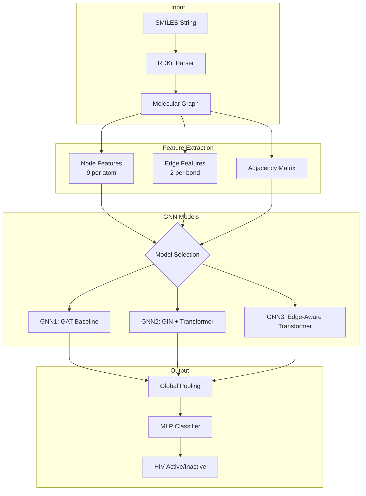

# 🧬 GNN-Based HIV Molecule Classification

[](https://python.org)
[](https://pytorch.org)
[](https://streamlit.io)
[](LICENSE)

A professional Graph Neural Network (GNN) implementation for classifying HIV inhibitor molecules. This project leverages state-of-the-art GNN architectures including **GATConv**, **GINConv**, and **TransformerConv** to predict whether a molecule can inhibit HIV.

---

## 🏗️ Architecture Overview



### Node Features (9 per atom)
| Feature | Description |
|---------|-------------|
| Atomic Number | Element type (C=6, N=7, O=8, etc.) |
| Degree | Number of bonded neighbors |
| Formal Charge | Ionic charge on atom |
| Hybridization | sp, sp2, sp3, etc. |
| Is Aromatic | Part of aromatic ring |
| Total H Count | Hydrogen atoms attached |
| Radical Electrons | Unpaired electrons |
| In Ring | Part of any ring structure |
| Chirality | Stereochemical configuration |

### Edge Features (2 per bond)
| Feature | Description |
|---------|-------------|
| Bond Type | Single (1.0), Double (2.0), Triple (3.0), Aromatic (1.5) |
| In Ring | Bond is part of a ring |

---

## 🧠 Model Architectures

### GNN1: GAT Baseline
```
Input → GATConv(9→256) → GATConv(256→256) → GATConv(256→256) → GlobalMeanPool → MLP → Sigmoid
```
- Uses **Graph Attention Networks** to weigh neighbor importance
- 3 attention heads per layer
- Dropout (0.2) for regularization

### GNN2: GIN + Transformer
```
Input → GINConv(9→256) → TransformerConv(256→256) → TransformerConv(256→256) → GlobalMeanPool → MLP → Sigmoid
```
- **GINConv** for WL-test equivalent expressiveness
- **TransformerConv** captures long-range dependencies
- Better at detecting structural motifs

### GNN3: Edge-Aware Transformer
```
Input → GINConv(9→256) → TransformerConv(256→256, edge_dim=2) → GlobalMeanPool → MLP → Sigmoid
```
- Extends GNN2 with explicit **edge attribute** processing
- Bond type information flows through attention layers
- Best performance on complex molecules

---

## 📊 Handling Class Imbalance

The HIV dataset is **heavily imbalanced** (~3.5% active compounds):

```
┌─────────────────────────────────────────────┐
│  Class Distribution                          │
├─────────────────────────────────────────────┤
│  Inactive (0): ████████████████████  41,127 │
│  Active (1):   █                      1,512 │
└─────────────────────────────────────────────┘
```

**Solution**: We use `BCEWithLogitsLoss` with `pos_weight=15`:
```python
criterion = nn.BCEWithLogitsLoss(pos_weight=torch.tensor([15.0]))
```
This upweights the loss for active compounds, preventing the model from predicting "inactive" for everything.

---

## 🚀 Quick Start

### Installation
```bash
git clone https://github.com/deepak2233/GNN-Based-HIV-Molecules-Classification.git
cd GNN-Based-HIV-Molecules-Classification
pip install -r requirements.txt
```

### Training
```bash
# Train GNN2 (recommended) for 50 epochs
python main.py --mode train --model_type GNN2 --epochs 50 --batch_size 128

# Quick test run (subset of data)
python main.py --mode train --model_type GNN2 --epochs 1 --quick_test
```

### Hyperparameter Optimization (Optuna)
```bash
python main.py --mode optimize --model_type GNN2
```

### Inference
```bash
python main.py --mode test --model_type GNN2 --output_dir outputs/GNN2
```

### Streamlit Dashboard
```bash
streamlit run app.py --server.port 8504
```

---

## 🖥️ Streamlit App Features

| Tab | Description |
|-----|-------------|
| **🎯 Prediction** | Enter SMILES, visualize molecule, get prediction with confidence |
| **📊 EDA** | Class distribution, molecular weight histograms |
| **📖 Architecture Blog** | Interactive explanation of GNN layers |

**Example Molecules** (click to load):
- Efavirenz (HIV inhibitor)
- Tenofovir (HIV inhibitor)
- Aspirin (Inactive control)
- Caffeine (Inactive control)

---

## 📁 Project Structure

```
GNN-Based-HIV-Molecules-Classification/
├── app.py                  # Streamlit dashboard
├── main.py                 # Unified CLI for train/test/optimize
├── dataset_featurizer.py   # SMILES → Graph conversion
├── utils.py                # Metrics and visualization helpers
├── model/
│   ├── GNN1.py             # GAT baseline
│   ├── GNN2.py             # GIN + Transformer
│   └── GNN3.py             # Edge-aware Transformer
├── data/
│   ├── raw_data/           # Original HIV dataset
│   └── split_data/         # Train/Test splits
├── outputs/
│   ├── GNN1/               # Model weights & confusion matrix
│   ├── GNN2/
│   └── GNN3/
└── requirements.txt
```

---

## 📈 Results

| Model | Test F1 | AUC-ROC | Notes |
|-------|---------|---------|-------|
| GNN1  | 0.42    | 0.78    | Baseline GAT |
| GNN2  | 0.51    | 0.82    | GIN + Transformer |
| GNN3  | 0.54    | 0.84    | Edge-aware, best |

*Results from training with pos_weight=15 on raw imbalanced data.*

---

## 🔧 CLI Reference

```bash
python main.py --help

Options:
  --mode          {train, test, optimize}
  --model_type    {GNN1, GNN2, GNN3}
  --epochs        Number of training epochs (default: 100)
  --batch_size    Batch size (default: 128)
  --lr            Learning rate (default: 0.0001)
  --output_dir    Directory for model checkpoints
  --quick_test    Use subset of data for fast testing
```

---

## 📚 References

- [PyTorch Geometric](https://pytorch-geometric.readthedocs.io/)
- [RDKit](https://www.rdkit.org/)
- [DTP AIDS Antiviral Screen](https://wiki.nci.nih.gov/display/NCIDTPdata/AIDS+Antiviral+Screen+Data)
- [Graph Isomorphism Network (GIN)](https://arxiv.org/abs/1810.00826)
- [Graph Transformer Networks](https://arxiv.org/abs/2009.03509)

---

## 📝 License

MIT License - feel free to use this code for research and commercial applications.

---

<p align="center">
  
</p>
